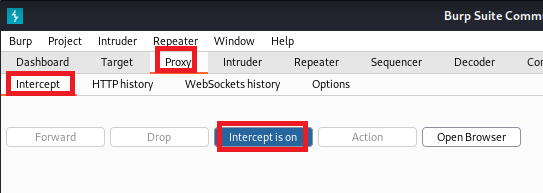

# Romper la autenticación (***Broken Authentication***).

     

Requisitos:
1. Máquina ***Router-Ubu***.
2. Máquina ***Kali Linux***.
3. Máquina ***Ubu_srv_JUICE_SHOP***

Las debilidades en la autenticación permiten al actor de la amenaza suplantar la identidad de un usuario de la aplicación. Para conseguir este objetivo se pueden recorrer diversos caminos. En los siguientes ejercicios exponemos algunos de ellos a modo de ejemplo.

## Ejercicio 1:  Cambiar el password del usuario ***Bender*** sin usar ni inyección de SQL ni la opción Contraseña olvidada.

***OBJETIVO***: Cambiar el password de un usuario llamado ***Bender***.

***PISTAS***: 

* Estudiar cómo se produce la request que cambia el password.
* Obtener un JWT (Token de autorización) para que el sistema te autorice y, en consecuencia, puedas cambiar el password.
* Como no conoces el password original de ***Bender***, no podrás usar la función de cambio de password de la aplicación, a pesar de estar autenticado.

***RESOLUCIÓN***. Los pasos para resolver el reto son.

Como siempre iniciamos ***ZAP***.

En primer lugar vamos a observar cómo se construye la request que cambia el password del usuario. Para ello nos logamos con el usuario que dimos de alta y procedemos a invocar la función de cambio de password. Esta opción está en el menú ***Account/Privacy & Security/Change Password***.


Aparecerá el formulario de cambio de password. 


Recordemos que lo que estamos buscando es la URL del servicio de cambio de password, así que rellenamos este formulario de la siguiente manera.

Para ***Current Password*** escribimos.
```
PASSWORD_ANTIGUO
```

En ***New Password*** escribimos.
```
NUEVO_PASSWORD
```

y en ***Repeat New Password*** ponemos.
```
NUEVO_PASSWORD
```

Hacemos clic en el botón ***Change***. Obviamente esto no funcionará, pero lo que vamos buscando es le URL de la request. Por lo tanto, en ***ZAP*** accedemos a ***History*** y localizamos una request en la forma que se muestra en la siguiente imagen.


Estudiando la ***Request*** podemos sacar información muy valiosa. En primer lugar podemos ver la URL con la query string que se manda a la aplicación.


Un poco más abajo vemos el ***Bearer Token***, al que también se le llama ***Token de autenticación***.  Este token, generado por el servidor debe ser reenviado por el cliente en las subsiguientes request para que dicha request sea aceptada por el servidor. 


Al seleccionar la ***Response*** podemos ver que el servidor contesta con el mensaje ***Current password is not correct.***


Hay dos cosas que están claras.

1) Si no conocemos el password actual del usuario, no seremos capaces de cambiar dicho password.
2) Actualmente estamos autenticados en la aplicación y el servidor nos envió el ***Bearer Token***.

En ***ZAP***, procedemos a editar la ***Request*** del ***HTTP Message***. Vamos a intentar cambiar el password eliminando de la ***Query string*** el parámetro correspondiente al password actual (***current***). La request debería quedar así.


Hacemos clic en el botón ***Replay in Console*** y, oh sorpresa!!!, la ***Response*** indica que el cambio de password ha sido correcto, devolviendo en el body el JSON correspondiente al usuario actual.


Para comprobar que realmente ha funcionado, cierra la sesión de tu usuario actual y haz un nuevo login usando como password el siguiente.
```
NUEVO_PASSWORD
```

La razón por la cual ha funcionado este hack es obvia. El codigo fuente de la aplicación no realiza convenientemente la comprobación del password actual que se le pasa por la querystring, provocando esta debilidad en la aplicación.

IMPORTANTE!!!
Para futuros laboratorios, te recomiendo que vuelvas a poner el password que tenía tu usuario de la aplicación. Así que esta vez cámbialo de la forma habitual sin modificar la request.

Recordemos que el objetivo fundamental de este ejercicio consistía en cambiarle el password a un usuario llamado ***Bender*** sin conocer su password actual. Para conseguirlo necesitamos que la aplicación nos autentique como dicho usuario.

El ***Ejercicio 3*** del ***lab-25-D*** permitió exfiltrar todos los usuarios de la base de datos. De esta forma podemos saber que el ***email*** del usuario ***Bender*** es.
```
bender@juice-sh.op
```

Y su ***id*** es.
```
3
```

En el ***Ejercicio 5*** del ***lab-25-D*** aprendimos a obtener un bearer token para cualquier usuario y, de esta forma, estar autenticados para la aplicación.

En consecuencia usaremos estas dos técnicas junto a la debilidad que hemos encontrado en este ejercicio para cambiar la contraseña del usuario ***Bender*** y quedarnos con su cuenta.

Volvemos a la página de login de la aplicación, y en el campo ***email*** pegamos el siguiente texto.
(Nota: Observa cómo hemos puesto el ***id*** y ***email*** del usuario Bender. Como password pueder poner el que quieras)
```
' UNION SELECT * FROM (SELECT 3 as 'id', '' as 'username', 'bender@juice-sh.op' as 'email', '12345' as 'password', 'accounting' as 'role', '123' as 'deluxeToken', '1.2.3.4' as 'lastLoginIp' , '/assets/public/images/uploads/default.svg' as 'profileImage', '' as 'totpSecret', 1 as 'isActive', '1999-08-16 14:14:41.644 +00:00' as 'createdAt', '1999-08-16 14:33:41.930 +00:00' as 'updatedAt', null as 'deletedAt')--
```

Ya estamos logados como Bender. 


Procedemos como vimos al principio del ejercicio. Vamos a la página para cambiar el password y ponemos.

Para ***Current Password*** escribimos.
```
PASSWORD_ANTIGUO
```

En ***New Password*** escribimos.
```
NUEVO_PASSWORD
```

y en ***Repeat New Password*** ponemos.
```
NUEVO_PASSWORD
```

En el historial de ZAP, capturamos la request, la editamos y eliminamos el parámetro ***current***. Hacemos clic en ***Replay in Console*** y ya habremos cambiado el password de Bender.

Puedes cerrar sesión y probar a inicarla con las siguientes credenciales. La cuenta de Bender ya es tuya.

Usuario.
```
bender@juice-sh.op
```

Password.
```
NUEVO_PASSWORD
```

## Ejercicio 2: Romper la autenticación 2FA.

Es preciso indicar que el hackeo que se va a hacer a la aplicación se debe exclusivamente a que existe una vulnerabilidad previa de inyección de SQL que permite logar al usuario sin conocer el password de éste. En ningún caso la debilidad mostrada se debe a la aplicación ***Google Authenticator***.

***OBJETIVO***: Iniciar sesión con un usuario que tiene activado un factor adicional de autenticación.

***PISTAS***: 

* Activar la 2FA para tu usuario actual. Descubre qué tipo de factor se está usando.
* Estudia la estructura de la tabla ***Users*** para determinar en el campo se almacena el factor de autenticación y cuántos usuarios la tienen habilitada.

***RESOLUCIÓN***. Los pasos para resolver el reto son.

Como siempre iniciamos ***ZAP***.

En primer lugar iniciamos sesión con nuestro usuario de la aplicación. A continuación vamos a la opción ***Account/Privacy & Security/2FA Configuration***. 


Al seleccionar esta opción veremos la siguiente pantalla.


Es fácil determinar que el factor de autenticación adicional es un password de un solo uso que caduca en un corto periodo de tiempo. ***TOTP***, o Time-Based One-Time Password, es una variante de la autenticación MFA que funciona gracias a un código que se genera de forma aleatoria y actúa como token de autenticación. Estos códigos se generan con aplicaciones muy conocidas, como ***Google Authenticator***. Para que el actor de la amenaza se pudiera logar en la aplicación, además de tener que saber el password, necesitaría tener el móvil al que se va a mandar el TOTP, considerándose éste método como muy fiable.

Vamos a ver como podemos romper esta autenticación.

En primer lugar necesitamos conocer cómo almacena la aplicación el token ***TOTP***. En el ***Ejercicio 2*** del laboratorio ***lab-25-D*** pudimos exfiltrar el esquema de la base de datos. En él vimos una tabla llamada ***Users*** que almacena la información de autenticación de los usuarios. Si observas la siguiente imagen, hay un campo que tiene toda la pinta de guardar la información de la 2FA para TOTP. Se llama ***totpsecret*** y por defecto se inicia a un string vacio. Además, es la ***novena (9)*** columna de la tabla.


En segundo lugar, será necesario saber qué usuarios de la aplicación tienen habilitada la 2FA. En nuestro caso es sencillo, porque en el ***Ejercicio 3*** del laboratorio ***lab-25-D*** fuimos capaces de exfiltrar toda la tabla ***Users***. Recreamos ese ataque para obtener todos los registros de la tabla de usuario. En la barra de direcciones del navegador escribimos.
```
http://192.168.20.80:3000/rest/products/search?q=ewrwerwewerwerwer')) UNION SELECT id, username, email, password, '5', '6', '7', '8', totpsecret FROM users--
```

El noveno campo de la tabla ***Users*** se corresponde con el campo ***deletedAt*** en la ***UNION SELECT***. Podemos comprobar que el registro número 9 se corresponde con un usuario de nombre ***wursbrot*** y tiene un valor configurado en el campo correspondiente al ***totpsecret***, tal y como se puede ver en la siguiente captura. 


Este es el valor del campo ***totpsecret***.
```
IFTXE3SPOEYVURT2MRYGI52TKJ4HC3KH
```

Necesitamos la aplicación ***Google Authenticator***. Para mayor comodidad, en lugar de usar un móvil, usamos ***Bluestacks*** (o cualquier emulador de Android). Instalamos la aplicación y al abrirla nos pide que demos el alta una cuenta. Generalmente usaríamos la cámara del móvil para obtener la clave de configuración a través del código QR, pero eso es precisamente lo que hemos capturado en el campo ***totpsecret***, así que elegimos la opción ***Ingresar clave de config.***.


Ponemos la siguiente información.

En ***Nombre de la cuenta*** ponemos cualquier cosa, por ejemplo.
```
juiceshop
```

En ***Tu llave*** pegamos el valor capturado en el campo ***totpsecret***.
```
IFTXE3SPOEYVURT2MRYGI52TKJ4HC3KH
```

Y en ***Tipo de clave*** dejamos el valor por defecto ***Basado en tiempo***.

Hacemos clic en ***Agregar*** y dejamos abierta la aplicación ***Google authenticator***.

Ahora procedemos a realizar el hackeo. Hacemos logout de nuestro usuario actual. A continuación escribimos esta URL en la barra de direcciones.
```
http://192.168.20.80:3000/#/login
```

Aprovechamos la inyección SQL que nos permitía logarnos sin conocer el password. En el campo ***email*** escribimos.
```
wurstbrot@juice-sh.op'--
```

En el campo ***Password*** puedes poner cualquier cosa. Luego haz clic en ***Log in***.


La aplicación pedirá el segundo factor. Es el momento de volver a la aplicación ***Google Authenticator*** para ver el código generado.


Por último, escribimos dicho código en el formulario de la aplicación y ya estaremos logados en la aplicación.


## Ejercicio 3: Resetear el password del usuario Bjoern a través del mecanismo de contraseña olvidada.


Como ya vimos en la parte teórica, la exposición en redes sociales puede ser el talón de Aquiles de la seguridad del inicio de sesión de un usuario. 

***OBJETIVO***: Cambiar la contraseña del usuario 'bjoern@owasp.org' de la aplicación.

***PISTAS***: 

* Descubre una forma sencilla de obtener los nombres de usuario de los clientes de la aplicación.
* Accede a la función de recuperación de contraseña de la aplicación y verifica la pregunta de seguridad que tiene configurada 'Bjoern'
* Localiza información sobre una mascota en las redes sociales de 'Bjoern'.
* No es necesario usar ZAP para esta práctica.


***RESOLUCIÓN***. Los pasos para resolver el reto son.

Para obtener el nombre de inicio de sesión del usuario podemos hacer un ataque previo de inyección de SQL y obtener los registros de la tabla de usuarios. También existe una forma más simple que consiste en leer las reseñas que algunos clientes han realizado sobre los productos.

La aplicación muestra en la reseña el nombre del usuario que la creó. De esta forma, es simple acceder al nombre de usuario de la potencial víctima. Para el resto de la práctica, este nombre de usuario es 'bjoern@owasp.org'.

Hacemos logout de nuestro usuario actual. A continuación escribimos esta URL en la barra de direcciones, que permite reseteal el password.
```
http://192.168.20.80:3000/#/forgot-password 
```

Observa, en la siguiente imagen, que cuando pones el nombre del usuario, la aplicación selecciona automáticamente la pregunta de seguridad. En este ejemplo, Bjoern eligió poner el nombre de su mascota favorita.


Ahora solo queda hacer algo de OSINT, es decir, acceder a las redes sociales del usuario buscando una mascota y, si somos afortunados, aparecerá el nombre.

Para ello puedes hacer uso de herramientas que automatizan la localización de información sobre la víctima, como puedes ver en este enlace: https://github.com/jivoi/awesome-osint

Usando estas herramientas, descubrirás que la víctima tiene perfil en Twitter. Usa el navegador y conecta a
```
https://twitter.com/bkimminich
```

Es cuestión de leer las publicaciones y, con suerte encontrarás algo, por ejemplo, una imagen de un gato que puedes ver en el rectángulo de color rojo.


Si haces clic en la imagen, aparecerá la publicación, es la que se intuye el nombre de la mascota (Zaya)


Solo queda escribir en el diálogo de recuperación de contraseña el nombre de la mascota.
```
Zaya
```

y poner una nueva contraseña, por ejemplo
```
Pa55w.rd
```

Acabamos de robar la cuenta de Bjoern en la aplicación. 

Recuerda que en este caso no existe una mala práctica de programación en concreto, sino que la vulnerabilidad se debe a un mecanismo de recuperación de contraseña débil que puede ser fácilmente explotado si se conoce información personal de la víctima.


## Ejercicio 3: Iniciar sesión con la cuenta de Gmail de Bjoern.


La autorización moderna permite que tu aplicación delegue en un proveedor de identidades como Google dicha responsabilidad. El objetivo de este laboratorio no es explicar cómo debes programar tu aplicación para que pueda beneficiarse del protocolo OAuth, sino demostrar cómo una deficiente implementación de este estándar en la aplicación, puede conducir a problemas de seguridad.

***OBJETIVO***: Inicia sesión con la cuenta de Gmail de un usuario usando que ha configurado la autenticación con Google.

***PISTAS***: 

* Localiza en el archivo 'main.js' cómo se implementa la autorización del protocolo OAuth en la aplicación.
* Determina si hay alguna debilidad en el código de JavaScript.
* Usa las herramientas del desarrollador.
* No es necesario usar ZAP para esta práctica.


***RESOLUCIÓN***. Los pasos para resolver el reto son.

Nota importante: Si no ves el botón 'Iniciar sesión con Google' es porque el contenedor de Docker no ha configurado convenientemente la autenticación con Google. No obstante, el reto es plenamente funcional, porque se trata de que descubras el código Javascript que presenta la debilidad. 

Inicia sesión con tu usuario en la aplicación.
```
http://192.168.20.80:3000/#/login
```

Habilita las herramientas del desarrollador en Firefox ***CTRL+Mayús+i***.

Localiza la llamnada al método Javascript "userService.oauthLogin", tal y como puedes ver en la imagen.


Esta es la parte que debe desarrollar el programador para integrar su aplicación con el OAuth de Google.

La debilidad se encuentra en la creación de la contraseña. Estudia el código marcado en la imagen.


El programador decició emplear un algoritmo simple (y vulnerable) para generar el password del usuario en la autenticación de Google. 
```
o.email.split('').reverse().join('')
```

Tiene como objetivo invertir los caracteres que forman la dirección de correo electrónico de la víctima.

De esta forma, para el correo electrónico de la víctima, que es
```
bjoern.kimminich@gmail.com
```

Se obtiene
```
moc.liamg@hcinimmik.nreojb
```

A continuación se llama a la función ***btoa***, que codifica en Base-64 la cadena anterior.

Para obtener dicha información, en una terminal de Kali, escribimos lo siguiente.
```
echo moc.liamg@hcinimmik.nreojb | base64
```

El resultado es
```
bW9jLmxpYW1nQGhjaW5pbW1pay5ucmVvamIK
```

En el código que puedes ver en la imagen, se guarda la contraseña codificada en base64 y posteriormente se inicia sesión en Google enviándola.


Como decíamos al inicio, puesto que la aplicación no tiene realmente configurada el OAuth con Google, no aparece el botón de iniciar sesión con Google y por consiguiente no puedes probar. Ojo, que no vale con poner estas credenciales en la página de login de la aplicación.

Ten en cuenta que esta vulnerabilidad en la aplicación se debe a una implementación débil (deficiente) en el código JavaScript de la aplicación. En ningún caso es debida a una mala implementación de OAuth por parte de Google.


## Ejercicio 4: Resetear la contraseña del usuario ***Bender*** por medio del mecanismo de contraseña olvidada.

Este es otro ejemplo de como un ataque OSINT puede robar la credencial de un usuario de la aplicación. Volvemos a demostrar que ofrecer un método de recuperar la contraseña basado en preguntas de seguridad es la peor idea que podemos tener como desarrolladores.

***OBJETIVO***: Roba la identidad del usuario Bender en la aplicación.

***PISTAS***: 

* El nombre de usuario de la víctima puedes obtenerlo leyendo las reseñas de los productos. Para agilizar la práctica, ese nombre de usuario es 'bender@juice-sh.op'.
* Ataca a través del procedimiento de recordar la contraseña olvidada.
* No hace falta usar ZAP.
* Investiga en Internet sobre el personaje Bender.


***RESOLUCIÓN***. Los pasos para resolver el reto son.

Accede a la página de login de la aplicación. 

A continuación escribe el nombre de usuario de la víctima.
```
bender@juice-sh.op
```

y haz clic en el enlace  ***Forgot your Password?***. Podrás comprobar que el usuario eligió como pregunta de seguridad el nombre de la empresa en la que trabajó por primera vez.

En consecuencia, el actor de la amenaza, realizará una búsqueda OSINT para intentar encontrar esa respuesta.

Si vas bien encaminado, Bender trabajó por primera vez en una empresa llamada ***Stop 'n' Drop***. Puede ser una buena pista, así que, escribe como respuesta a la pregunta de seguridad lo siguiente:
```
Stop 'n' Drop
```

Es un buen intento, pero no funciona.


El actor de la amenaza puede estar seguro que la respuesta a la pregunta de seguridad tiene que ver con ***Stop 'n' Drop***, pero la víctima puede que lo haya escrito de una manera ligeramente diferente.

Para conseguir su objetivo, plantea usar una herramienta que permita hacer, de forma automática, un ataque de fuerza bruta al mecanismo de recuperación de contraseña usando modificaciones y permutaciones de la frase ***Stop 'n' Drop***. Decide usar la herramienta **Sniper*** de otra solución muy conocida en ciberseguridad. Burp Suite.

Burp se caracteriza por siguiente:

* Ser una potente herramienta de prueba de penetración y evaluación de seguridad diseñada para ayudar a los profesionales de seguridad a identificar y mitigar vulnerabilidades en aplicaciones web. 

* Es desarrollada por PortSwigger, y es una solución de pago. No obstante, con la versión de comunidad es posible hacer muchas cosas.

* Está formada por varias herramientas interconectadas que ofrecen una amplia gama de capacidades. El componente principal es el "Proxy", que actúa como un intermediario entre el navegador y la aplicación web objetivo. Esto permite a los usuarios interceptar y modificar las solicitudes y respuestas HTTP, lo que facilita la identificación de vulnerabilidades como inyecciones SQL, cross-site scripting (XSS) y otros ataques comunes. Es decir, más o menos lo mismo que hace ZAP, pero te ofrece un nivel de automatización más alto.

* Al igual de ZAP, también ofrece un "Scanner", que automatiza la búsqueda de vulnerabilidades en una aplicación web. Los resultados se presentan en un informe detallado que ayuda a los profesionales de seguridad a priorizar y abordar las vulnerabilidades. Si quieres tener la totalidad de estos informes, necesitarás la versión comercial de pago.

* El "Spider" de Burp Suite es una herramienta que permite rastrear automáticamente una aplicación web para descubrir todas las páginas y funcionalidades disponibles. Esto es útil para asegurarse de que ninguna parte de la aplicación quede sin analizar y para comprender la estructura general de la aplicación.

* Incluir las herramientas de "Repeater" y "Intruder" que permiten a los usuarios realizar pruebas manuales y ataques automatizados de fuerza bruta o fuzzing, respectivamente. Estas herramientas son esenciales para evaluar la resistencia de una aplicación a ataques.

* "Sequencer" es otra característica destacada de Burp Suite, que se utiliza para analizar la aleatoriedad y la calidad de los tokens de sesión generados por una aplicación. Esto es crucial para detectar debilidades en la generación de tokens de seguridad y evitar ataques de predicción.

BurpSuite viene instalada en Kali, así que procedemos a iniciarla. En una terminal en la máquina Kali Linux, escribimos.

En una terminal, escribimos:
```
burpsuite
```

Aceptamos los términos de uso.


La versión de comunidad no permite guardar los proyectos, así que hacemos clic en el botón ***Next***.


Aceptamos la configuración por defecto (vamos a cambiarla a continuación) haciendo clic en el botón ***Start Burp***


Es el momento de observar cómo ha definido Burp su proxy. Para ello hacemos clic en ***Proxy*** y luego en ***Options***. Podrás ver que el proxy está en ***127.0.0.1*** y que su puerto es el ***8080***.


También necesitarás que el navegador de Kali pase por el proxy Burp. Abre ***Firefox***, haz clic en el menú y elige ***Settings***. 


En los settings, usa el buscador para localizar los ajustes del proxy. Haz clic en el botón ***Settings***.


Asegúrate que la configuración queda como indica la siguiente imagen.


Haz clic en ***Ok*** y sal de la configuración de ***Firefox***.

Ahora necesitamos instalar la Autoridad Certificadora de Burp. Esto permitirá el uso de HTTPS desde el navegador. 

De forma predeterminada, cuando navegas por un sitio web HTTPS a través de Burp, el proxy genera un certificado TLS para cada host, firmado por su propio certificado de autoridad de certificación (CA). Este certificado de CA se genera la primera vez que se ejecuta Burp y se almacena localmente. Para utilizar Burp Proxy de forma más eficaz con los sitios web HTTPS, deberás instalar el certificado de CA de Burp como raíz de confianza en su navegador.

En Burp, dirígete de nuevo a ***Proxy*** y a ***Options***. Haz clic en el botón ***Import/Export CA Certificate***


Vamos a exportar el certificado de la Autoridad Certificadora de Burp. Para ello haz clic en el botón ***Certificate in DER format***, en la sección ***Export***.


Guárdalo en un archivo.


Finaliza el asistente de exportación.

En ***Firefox***, vuelve a las opciones y usa el buscador para encontrar los certificados. Haz clic en el botón ***View Certificates***.


Asegúrate que está seleccionado el almacén de ***Autoridades Certificadoras*** (Authorities) y haz clic en el botón ***Import***.


Localiza el archivo que exportaste. Es posible que tengas que cambiar el filtro para que se vean todos los archivos. Impórtalo, marca las casillas de verificación y haz clic en el botón ***OK***.


Haz clic en ***OK*** para salir del administrador de certificados.

Vamos a proceder a realizar un ataque de fuerza bruta con Burp sobre el servicio de recuperación de contraseñas.

Recuerda que nos habíamos quedado en que la contraseña es probable que esté relacionada con la frase ***Stop 'n' Drop***, pero la víctima podría haberla modificado ligeramente.

Para proceder al ataque es necesario que capturemos una request asociada con el servicio de reseteo de password. Para ello, desactivamos momentáneamente la captura de paquetes (MitM) de Burp.

En Burp, asegúrate que ***Proxy***/***Intercept*** está desactivada. Lo consegirás haciendo clic en el botón ***Intercept is On***, hasta que aparezca que está desactivado.



Podrás navegar por la aplicación sin que Burp intercepte nada. Pruébalo.

Ahora, desde el navegador, conecta con la URL de recuperación de password.
```
http://192.168.20.80:3000/#/forgot-password
```

En el formulario de contraseña olvidada (Forgot Password) introduce la siguiente información.

En ***Email***
```
bender@juice-sh.op
```

En ***Security Question*** escribe (Nota: Esta no es la respuesta correcta, pero algo hay que poner)
```
Stop 'n' Drop
```

En ***New Password***
```
Pa55w.rd
```

Y en ***Repeat New Password***
```
Pa55w.rd
```

Atención ahora. NO hagas clic en el botón ***Change***. Antes hay que activar la interceptación de Burp.

En Burp, asegúrate que la interceptación está habilitada.


Vuelve al navegador y haz clic en el botón ***Change***. Aparentemente nada ocurre, pero eso debe ser así porque Burp está interceptando en tráfico. 

Vuelve a Burp y ve haciendo clic en el botón ***Forward*** para ir dejando pasar las request hacia el servidor, hasta que encuentres una como se indica en la imagen. Es la request que intenta resetear el password.


No funcionará, como bien sabes, porque la respuesta a la pregunta de seguridad no es la correcta (aunque intuimos que por ahí van los tiros).

Con la request aún seleccionada, haz clic en el botón ***Action*** y a continuación elige en el menú ***Send to Intruder***. 


***Intruder*** es una poderosa herramienta que va a permitirnos hacer ataques de fuerza bruta (entre otros) reenviando la request capturada.

En Burp, selecciona en el menú ***Intruder*** y luego ***Positions***


El ataque de fuerza bruta consiste en ir sustituyendo los parámetros de la request. Estos parámetros se indican mediante 'placeholders' que usan el carácter '§' como inicio y final del marcador. Observa en la siguiente imagen los mencionados placeholders. Para mayor énfasis, Burp los colorea en verde.


El ataque consiste en enviar sucesivas request donde vamos cambiando el campo ***answer***. El resto nos interesa dejarlos como está, así que para decirle a Burp que no los toque, situamos el cursor en su interior y hacemos clic en el botón ***Clear §***.


Retira los placeholders de forma que solo quede el de ***answer***, como indica la imagen.


Ya le hemos dicho a Burp cuál es el parámetro de la Request que vamos a ir cambiando. Ahora debemos decirle cómo hacerlo. Para la práctica que estamos desarrollando, vamos a agregar un diccionario con las posibles soluciones a la pregunta de seguridad.

Si no has clonado el repositorio es el momento. Sitúate en tu directorio Home. En una terminal, escribe.
```
cd ~
```

Clona el repo.
```
git clone https://github.com/antsala/SecureProgramming_LABS.git
```

Entra en el directorio '25'
```
cd ~/SecureProgramming_LABS/25
```

Abre el archivo con el diccionario y estúdialo.
```
nano diccionario.txt
```

Cierra el archivo sin modificar. En un ataque real, este diccionario se puede generar con herramientas especialicadas como ***crunch*** y otras herramientas.

Vuelve a Burp e importa el diccionario.


Es el momento de atacar. Para ello hacemos clic en el botón ***Start attack***.


 


https://curiositykillscolby.com/2020/12/09/pwning-owasps-juice-shop-pt-44-reset-benders-password/


***FIN DEL LABORATORIO***

[Vamos al siguiente lab](../25/lab-25-F.md)