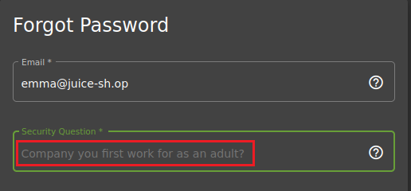

# Exposición de datos sensibles (***Sensitive Data Exposure***).

     

Requisitos:
1. Máquina ***Router-Ubu***.
2. Máquina ***Kali Linux***.
3. Máquina ***Ubu_srv_JUICE_SHOP***

Los documentos que son accesibles debido a vulnerabilidades o malas configuraciones son de incalculable valor para el actor de la amenaza. Además de la información que podría tener el propio documento, puede ofrecer pistas para conseguir mayores objetivos.

## Ejercicio 1: Acceder a un documento confidencial. 

***OBJETIVO***: Exfiltra documentos que no están bien protegidos en el servidor.

***PISTAS***: 

* Localiza links (URLs) que apuntan directamente a archivos. 
* Modifica dichas URLs para conseguir acceder a otros archivos.

***RESOLUCIÓN***. Los pasos para resolver el reto son.

Como siempre iniciamos ***ZAP***.

Realiza con ZAP una exploración manual sobre la siguiente URL.
```
http://192.168.20.80:3000
```

Según aprendiste en el tutorial de HUD, ZAP tiene dos tipos de herramientas para determinar todos los recursos accesibles en el sitio web que estás atacando. Estos son:

* *Spider*: Esta herramienta se usa para descubrir nuevos recursos o URLs en un sitio concreto. Empieza con una lista de URLs a visitar, llamadas ***seeds***. La araña visita dichas URLs así como los links que estas contengan de forma recursiva.

* *Ajax Spider*: El Spider de Ajax realiza la misma función que el Spider anterior pero además es capaz de seguir los links que se generan por medio de javascript. Es bastante más lento que el Spider normal, pero es capaz de encontrar muchas más URLs, sobre todo en aplicaciones modernas.

Está claro entonces, que la mejor forma de buscar documentos que estén expuestos es usar una araña. Vamos a empezar con el Spider convencional, así que hacemos clic en el panel de opciones derecho, en el icono de la araña negra, tal y como señala la imagen.


Se muestra un mensaje indicando que la aplicación (192.168.20.80:3000) no está en ***scope*** y nos pregunta si queremos ponerla en ámbito. Esto debe ser así para que el spider no agregue los links que puedan aparecer en la aplicación y que tengan como destino URLs externas a la misma, como pudieran ser enlaces a Google u otros servicios de Internet. Hacemos clic en el botón ***Start***, que agregará la aplicación al ***scope*** e iniciará el descubrimiento.


Dejamos al Spider que localice las URLs. No es necesario esperar a que termine, así que mostramos el historial para ver qué está descubriendo.

Como podemos ver en la imagen, el spider no ha encontrado mucho. Concretamente, tres URLs de la aplicación que no conducen a ningún descubrimiento importante.


Puesto que ***Juice Shop*** es una aplicación moderna, vamos a probar con el ***Ajax Spider***, que es la opción recomendada para estos casos. Hacemos clic en el botón apropiado.


Aparece un cuadro de diálogo para iniciar la araña. Seleccionamos ***Firefox*** en el despegable ***Browser*** y hacemos clic en el botón ***Start***.


Pasado un rato (5 minutos) vamos a ver las URLs que ha descubierto el spider. Para ello detenemos ***Ajax Spider*** y hacemos clic en el botón ***Sites***, en el panel derecho del HUD.


En la lista de sitios, hacemos clic en el botón ***+*** correspondiente a la aplicación que estamos hackeando (http://192.168.20.80:3000).


Ahora podemos ver todas las requests que ha hecho el spider al ir recorriendo los links de la aplicación. Es cuestión de leerlas detenidamente con la intención de localizar algún archivo que tenga especial interés para el actor de la amenaza. En nuestro ejemplo, vemos que hay una serie de peticiones interesantes en la ruta ***http://192.168.20.80:3000/ftp***. Concretamente nos llama la atención el documento ***acquisitions.md***.


Hacemos clic en dicha request, y como se puede ver en la imagen. Es un documento confidencial que no está bien protegido.


Ahora solo queda conectar a la siguiente URL para exfiltrar el documento.
```
http://192.168.20.80:3000/ftp/acquisitions.md
```


## Ejercicio 2: Ganar acceso a los logs del servidor.

***OBJETIVO***: Obtén acceso a archivos log.

***PISTAS***: 

* Usa la herramienta ***Forced Browse*** de ZAP. 

***RESOLUCIÓN***. Los pasos para resolver el reto son.

Como siempre iniciamos ***ZAP***.

Realiza con ZAP una exploración manual sobre la siguiente URL.
```
http://192.168.20.80:3000
```

Hemos visto que el HUD de ZAP es una herramienta muy cómoda de usar, pero es el momento de usar la herramienta completa. Para ello, localiza la ventana en la que se ejecuta ZAP, que debe ser como la que muestra la imagen.


Las arañas solo son efectivas si la URL aparece en un link, ya sea de HTML o generado por javascript. Por lo tanto, pueden existir directorios en el sitio que estamos estudiando que permanezcan ocultos porque estos no aparecen en ningún link. La única forma de descubrirlos es por medio de un ataque de fuerza bruta, consistente en usar un archivo o diccionario que contiene nombres de directorios habituales (login, logout, ...) y tener suerte en el sentido de que el programador haya usado nombres habituales para los directorios de la aplicación.

Para activar esta herramienta, hacemos clic con boton derecho en la aplicación que deseamos estudiar, en nuestro caso es ***http://192.168.20.80:3000*** y elegimos la opción ***Attack/Forced Browse Directory (and Children)***.


En la parte inferior, elegimos como lista ***directory-list-1.0.txt*** y hacemos clic en el icono ***play***. ZAP comenzará a buscar directorios usando el diccionario.
(Nota: El escaneo es recursivo al haber elegido la opción ***children***. De esta forma por cada directorio descubierto se vuelve a iniciar el proceso.)


(Nota: En el entorno de laboratorio ocurre que, debido al gran número de request/s que envía ZAP, el contenedor de Docker se queda sin memoria y se detiene. En un escenario real, ***Forced Browse*** finalizaría mostrando la lista de directorio descubiertos)

De todos los directorios descubiertos, hay uno que llama especialmente la atención, así que nos conectamos a la siguiente URL.
```
http://192.168.20.80:3000/support/logs
```

En el que podemos ver archivos muy interesantes.


Y si abrimos cualquiera de ellos, podremos localizar información que permitiría hacer otro tipo de ataque.


## Ejercicio 3: Fuga de información a través de la API.

***OBJETIVO***: Exfiltra información por medio de un Endpoint de la API que no está bien protegido.

***PISTAS***: 

* Localiza un endpoint que no está bien protegido. 
* No se utiliza SQL injection en este caso.

***RESOLUCIÓN***. Los pasos para resolver el reto son.

Como siempre iniciamos ***ZAP***.

Realiza con ZAP una exploración manual sobre la siguiente URL.
```
http://192.168.20.80:3000
```
Si no estuvieras logado, inicia sesión con tu usuario en la aplicación.

La aplicación tiene un endpoint que permite cosultar información sobre el usuario logado, el problema es que podemos capturar esa información y acceder a propiedades ***delicadas*** de ese usuario, como el ***id*** que la aplicación le asigna internamente.

Lo primero que debemos hacer es localizar el endpoint vulnerable y, para ello, debemos localizarlo. Aunque hay muchas técnicas para ello, la más simple y no por ello poco efectiva, es activar la araña (Ajax Spider) y dejar que vaya descubriendo. 

Tras un rato, nos fijamos en un endpoint curioso, concretamente ***/rest/user/whoami***, cuya request ha sido capturada por la araña.


Paramos la araña y, elegimos ***History***. En el historial localizamos las request a ***/rest/user/whoami***. Para cada una de ellas, hacemos clic derecho y, en el menú contextual, elegimos la opción ***Open/Resend with Request Editor...***. Debemos localizar una request que contenga el token de autorización.


En la request, observamos que no se mandan parámetros. La vulnerabilidad consiste en enviar un parámetro llamado ***callback***. 
(Nota: Queda fuera de esta actividad explicar como el parámetro ***callback*** puede encapsular una función que exfiltre información de la aplicación. Si quieres aprender sobre esto lee este artículo: https://www.filecloud.com/blog/using-jsonp-for-cross-domain-requests/)

Edita la request hasta que la URL tome la forma que muestra la imagen.


Hacemos clic en el botón ***Send*** y esperamos la respuesta. Como puede observarse, la aplicación está exfiltrando información, por ejemplo el ***id*** del usuario con el que estamos logado. 


## Ejercicio 4: Acceder a un archivo de backup olvidado por un programador.


***OBJETIVO***: Acceder a un archivo de backup que un programador ha dejado accidentalmente en el servidor.

***PISTAS***: 

* Localiza un repositorio de archivos (ftp)
* Comprueba que el archivo de backup no se puede descargar directamente.
* Usa la técnica ***Poison Null Byte*** para saltar la restricción de descarga.

***RESOLUCIÓN***. Los pasos para resolver el reto son.

Como siempre iniciamos ***ZAP***.

Realiza con ZAP una exploración manual sobre la siguiente URL.
```
http://192.168.20.80:3000
```

Si no estuvieras logado, inicia sesión con tu usuario en la aplicación.

En el ***Ejercicio 1*** del laboratorio ***lab-25-F***, vimos que en la ruta ***http://192.168.20.80:3000/ftp*** había una serie de documentos interesantes. Para este ejercicio nos fijamos en uno llamado ***package.json.bak***. Este archivo parece ser un backup del archivo ***package.json***, que se usa para almacenar información importante sobre la aplicación. Por esta razón, si el actor de la amenaza es capaz de conseguirlo, podrá estudiar cómo está construida la aplicación y, en consecuencia, determinar otros vectores de ataque más efectivos.

En consecuencia, intentemos descargar directamente el archivo. En la barra de dirección escribimos.
```
http://192.168.20.80:3000/ftp/package.json.bak
```

La aplicación responde con un mensaje en que se puede ver claramente que solo los documentos ***pdf*** se pueden descargar.


Este mensaje se produce porque la aplicación determina la extensión del archivo que se pretende descargar, a menudo por medio de una expresión regular. En el ataque del byte nulo (Null Byte) se inserta el byte ***\0*** justo antes de la extensión, con la idea de alterar el resultado de la comprobación de la extensión del archivo. En este link puedes ver cómo funciona este ataque: ***https://defendtheweb.net/article/common-php-attacks-poison-null-byte***.

La codificación URL del byte nulo es ***%2500***, así que intentamos descargar el archivo escribiendo la siguiente URL en la barra de direcciones.
```
http://192.168.20.80:3000/ftp/package.json.bak%2500.md
```

Se puede comprobar que por medio de está técnica podemos saltar la comprobación de extensión para los archivos que permite descargar el servidor.


## Ejercicio 5: Localiza el endpoint que sirve datos de uso de la aplicación para que sean leídos por un popular sistema de monitorización.


***OBJETIVO***: Localiza el endpoint que sirve los datos y comprueba que no está bien protegido.

***PISTAS***: 

* Busco por Internet cual es uno de los sistemas de monitorización Open Source más populares. Su nombre tiene que ver con el personaje histórico que robó el fuego a los dioses y lo entregó a los humanos.
* Estudia cómo se realiza la configuración por defecto con la idea de localizar alguna URL.
* Conectate a dicha URL y verifica que se está sirviendo datos de monitorización.

***RESOLUCIÓN***. Los pasos para resolver el reto son.

Efectivamente, el software referido es ***Prometheus***, consistente en un kit de herramientas de monitoreo y alerta de sistemas de código abierto originalmente creado en SoundCloud. Desde su creación en 2012, muchas empresas y organizaciones han adoptado Prometheus, y el proyecto tiene una comunidad de desarrolladores y usuarios muy activa. Ahora es un proyecto de código abierto. Prometheus se unió a la Cloud Native Computing Foundation en 2016 como segundo proyecto alojado, después de Kubernetes.

Los desarrolladores de Juice Shop no se han molestado en cambiar la URL donde se sirven las métricas, es decir, usa la configuración por defecto. 

En este link, puedes acceder a la documentación del producto. 
```
https://prometheus.io/docs/introduction/first_steps/
```

Una rápida lectura al mismo te servirá para determinar cuál es la URL que sirve las métricas. Concretamente la siguiente.
```
http://192.168.20.80:3000/metrics
```

Conectate con el navegador y tendrás el reto resuelto.


## Ejercicio 6: Robar los datos personales de otro sin usar inyección.

***OBJETIVO***: Obtener datos de un usuario sin conocer su credencial.

***PISTAS***: 

* Usa la función de exportación de DSR (Respuesta a las solicitudes del interesado) del RGPD. La tienes disponible en ***Account/Privacy&Security/Request Data Export***.
* Usa un proxy de ataque para determinar qué información devuelve una response cuando has realizado un pedido. Observa cómo se ofusca la dirección de correo electrónico en dicha response e intenta determinar la lógica de dicha ofuscación.
* Elige un usuario víctima en la aplicación. 
* Registra un nuevo usuario cuyo email se ofusque de la misma forma que el de la víctima.
* Realiza una request al servicio de exportación de datos de DSR y obtendrás la información de los pedidos de la víctima.
* Es necesario usar ZAP o Burp.

***RESOLUCIÓN***. Los pasos para resolver el reto son.

El Reglamento general de protección de datos (RGPD) de la Unión Europea (UE) otorga derechos importantes a las personas con respecto a sus datos. Cada vez es más común que las aplicaciones incorporen servicios que permitan conocer al interesado la información que la aplicación almacena sobre ellos, por ejemplo, los pedidos que se han realizado.

Una implementación débil de este servicio puede conducir a que un actor de la amenaza exfilter información de los clientes de una organización.

Inicia ZAP. En una terminal, escribe
```
owasp-zap
```

Realiza una exploración manual a la aplicación.
```
http://192.168.20.80:3000
```

Lógate con tu usuario y realiza un pedido.


Necesitamos acceder a la información del pedido. Para ello selecciona la siguiente opción de la aplicación: ***Account/Orders&Payments/Order History***


Haz clic en el icono del "Camión", tal y como indica la imagen. Te llevará a la página de seguimiento del pedido.


Observa la URL en el navegador. 


Ahora debes localizarla en el historial de ZAP.


Haz doble clic en ella y selecciona la response. Podrás observar cómo se ha ofuscado el campo ***email***. ¿Eres capaz de identificar el patrón elegido por el programador?


Sin duda, la ofuscación consiste en retirar las vocales y sustituirlas por un asterisco. Esta información será muy importante para realizar el hackeo.

Vamos a proceder a realizar una consulta DSR para el usuario que actualmente está logado. Para ello accede a la opción ***Account/Privacy&security/Request Data Export***.


Selecciona ***JSON*** como formato de salida, resuelve el catpcha y haz clic en el botón ***Request***.


Podrás ver la información del pedido que has realizado.


Ahora viene el hackeo. Elige a tu víctima, por ejemplo el usuario con el que estás logado. Su email es ***el_lado_oscuro@hotmail.es***. Sustituye las vocales por asteriscos. El resultado del algoritmo de ofuscación será el siguiente.


Cierra la sesión del usuario actual (que será tu víctima) y registra un nuevo usuario cuyo email genere el mismo resultado para la ofuscación, por ejemplo, el siguiente.


En la imagen puedes comprobar como se ha iniciado sesión con el nuevo usuario.


Este usuario es nuevo y no ha realizado ningún pedido en la aplicación.

Vuelve a solicitar una exportación de datos DSR en ***Account/Privacy&Security/Request Data Export***. Selecciona ***JSON*** y resuelve el captcha si se pide.

Podrás comprobar que se exfiltra la información de pedidos de la víctima.


Esto es debido a que la ofuscación del email del usuario con el que estás logado produce el mismo resultado que para el email de la víctima. La debilidad de la aplicación consiste en que se realizan consultas a la base de datos con el email ofuscado, lo cual conduce a esta vulnerabilidad.


## Ejercicio 7: Localizar en Internet información fugada del password de un usuario.

***OBJETIVO***: Localizar una contraseña exfiltrada en Internet.

***PISTAS***: 

* Busca información en ***Stackoverflow.com*** sobre los log de acceso. Concretamente busca la etiqueta ***access-log***.
* De las entradas anteriores localiza una denominada "less-verbose-access-logs-using-expressjs-morgan".
* En ella hay un link a ***PasteBin***. Síguelo y localiza contenido relacionado con el cambio de password.
* Decodifica el password y determina a qué usuario de Juice Shop pertenece.
* Inicia sesión con la credencial de dicho usuario.
* No es necesario usar ZAP o Burp.

***RESOLUCIÓN***. Los pasos para resolver el reto son.

El uso de servicios como ***Pastebin*** o similares puede plantear varios problemas de seguridad. En primer lugar, la naturaleza pública y accesible de estos servicios puede exponer información confidencial si los usuarios no configuran adecuadamente la privacidad de sus publicaciones. Datos sensibles, como ***contraseñas***, ***información personal*** o ***detalles de acceso a sistemas***, pueden caer en manos equivocadas si no se toman precauciones.

Además, estos servicios a menudo se utilizan para ***compartir código fuente y scripts***. Si los usuarios no tienen cuidado, podrían compartir inadvertidamente fragmentos de código que permitenque a los actores de la amenaza obtener información valiosa para llevar a cabo ataques.

Otro riesgo está relacionado con el almacenamiento temporal de datos en estos servicios. Aunque muchos de ellos eliminan automáticamente el contenido después de un tiempo, es posible que la información sensible permanezca en caché o sea accesible temporalmente, lo que podría ser explotado por actores malintencionados.

En resumen, el uso de servicios como Pastebin puede plantear riesgos de privacidad y seguridad si los usuarios no son conscientes de las configuraciones de privacidad, comparten inadvertidamente información sensible o no consideran las implicaciones de seguridad al utilizar estos servicios para compartir código y datos.

Un actor de la amenaza, lee las entradas relacionadas con una cuestión concreta. El programador pregunta en el foro cómo puede reducirse la cantidad de información que se genera al usar ***Morgan***.

Morgan es un middleware de registro (logging) para aplicaciones Express. Se utiliza para registrar las solicitudes HTTP entrantes en el servidor. Proporciona información detallada sobre cada solicitud, como la URL, el método HTTP utilizado y el código de estado de la respuesta. Este middleware es útil para el desarrollo y la depuración, ya que permite rastrear y analizar el comportamiento de las solicitudes.

Visita este link en stackoverflow.
```
https://stackoverflow.com/questions/tagged/access-log
```

Localiza información sobre.
```
less vervose access logs morgan
```

La búsqueda debe llevarte a la siguiente URL.
```
https://stackoverflow.com/questions/57061271/less-verbose-access-logs-using-expressjs-morgan
```

Lee el post y observa que se ha publicado un enlace hacia ***PasteBin***. Sígue dicho enlace.


Como podrás comprobar, el enlace de PasteBin permite acceder a una cantidad de información importante. 


Usa el buscador y localiza el contenido relacionado con.
```
password
```

Aparecerá la siguiente entrada en el log.


Observa que los parámetros ***new*** y ***repetat*** tienen contenidos diferentes, por lo que la aplicación devuelve un ***401*** indicando que el cambio de password ha fallado (porque no coinciden los valores). Esto podría indicar que el password actual aún no ha sido cambiado y, además, que tenemos su hash, que es.
```
0Y8rMnww$*9VFYE%C2%A759-!Fg1L6t&6lB
```

El actor de la amenaza tiene una parte de la solución, el hash, pero no conoce el usuario al que le corresponde. Para resolver este problema, puede:

* Hacer un ataque de ***Password Spraying***, una vez obtenida la lista de los usuarios (por medio de otro ataque descrito en estos laboratorios)
* Hashear el password obtenido y compararlo con la lista de hashes de los usuarios (también obtenida desde otro ataque previo)

Para acelerar el desarrollo de esta práctica, te facilitamos el usuario correcto, que es.
```
J12934@juice-sh.op
```

Ya solo queda probar si podemos logarnos con esa credencial. Conéctate con el navegador a.
```
http://192.168.20.80:3000/login#/login
```

Como usuario pon.
```
J12934@juice-sh.op
```

Y como contraseña, la capturada.
```
0Y8rMnww$*9VFYE§59-!Fg1L6t&6lB
```

Te has logado correctamente.


La debilidad que conduce al hackeo de la aplicación no puede ser achacada a esta misma, sino a una falta de celo del desarrollador al consultar los foros. Es muy común, cuando compartes información, por ejemplo la de un log, no escrudiñarla con la idea de detectar si se está fugando información importante. Generalmente nos limitamos a usar copiar y pegar y esto podría conducir a problemas de seguridad.

## Ejercicio 8: Determina la respuesta a la pregunta de seguridad de ***Emma***.

***OBJETIVO***: Descubrir la respuesta a través de una pista visual.

***PISTAS***: 

* La víctima tiene como email ***emma@juice-sh.op***
* Intenta cambiar la contraseña de emma para verificar cuál es su pregunta de seguridad.
* Visualiza la fotogalería de la aplicación.
* Céntrate en la última, la del edificio y usa un editor gráfico que pueda realizar ampliaciones.
* Localiza alguna pista conducente a ser la respuesta de la pregunta de seguridad.
* No es necesario usar ZAP o Burp.

***RESOLUCIÓN***. Los pasos para resolver el reto son.

Los usuarios a menudo eligen contraseñas basadas en pistas visuales porque les resulta más fácil recordar información visual que secuencias de caracteres alfanuméricos o complejas. Aquí hay algunas razones por las cuales algunos usuarios optan por contraseñas basadas en pistas visuales:

* Memoria visual fuerte: Algunas personas tienen una memoria visual más fuerte que una memoria basada en texto. Recordar patrones visuales o imágenes puede resultar más natural y menos propenso a errores.

* Asociación con imágenes o eventos significativos: Las pistas visuales pueden estar vinculadas a eventos o imágenes significativos en la vida del usuario. Por ejemplo, podrían utilizar el nombre de su mascota, el año de su graduación o una imagen que sea memorable para ellos.

* Creatividad y originalidad: La elección de pistas visuales a menudo permite a los usuarios ser más creativos y originales en la creación de sus contraseñas. Esto puede hacer que la contraseña sea más única y, en teoría, más segura.

Aunque las contraseñas basadas en pistas visuales pueden tener ventajas en términos de facilidad de recordar, también es importante señalar que a veces pueden ser menos seguras si son predecibles o fácilmente asociadas con la vida del usuario. 

Obtén la pregunta de seguridad elegida por emma. Conéctate a la siguiente dirección.
```
http://192.168.20.80:3000/login#/forgot-password
```

En Email escribe.
```
emma@juice-sh.op
```

Como puedes observar en la imagen, la pregunta de seguridad tiene que ver con el antiguo lugar de trabajo de Emma.



Visita la foto galería de la aplicación, donde los usuarios suben fotos. Haz clic en el menú de la parte izquierda de la aplicación y elige.


El pseudónimo de emma es ***E=ma2***. Localiza la imagen, descárgala, amplíala y localiza información de interés.

En una ventana podrás ver lo siguiente, que podría tener que ver con la respuesta a la pregunta de seguridad.


Accede a la página de recuperación de contraseña.
```
http://192.168.20.80:3000/login#/forgot-password
```

Como usuario pon este correo.
```
emma@juice-sh.op
```

Y como respuesta a la pregunta de seguridad, escribe.
```
ITsec
```

En nueva contraseña y repetir contraseña, escribe.
```
Pa55w.rd
```

haz clic en el botón ***Change*** y habrás cambiado la contraseña.

Este hackeo demuestra que muchos usuarios usan pistas visuales para sus credenciales o información secreta. Un actor de la amenaza que tenga la intuición (y suerte) de dar con la clave, puede hackear la aplicación. Como programadores no podemos controlar este comportamiento del usuario.

***FIN DEL LABORATORIO***

[Vamos al siguiente lab](../25/lab-25-G.md)