# Validación de datos de entrada inapropiada (***Improper Input Validation***).

     

Requisitos:
1. Máquina ***Router-Ubu***.
2. Máquina ***Kali Linux***.
3. Máquina ***Ubu_srv_JUICE_SHOP***

La pricipal amenaza a la que se ve sometida una aplicación web es la ausencia o un control incorrecto del texto que puede introducir un atacante en un campo de formulario o parámetro en general. Es conocido por todos que si usas un buen framework de desarrollo, éste debería proteger tu aplicación frente a este tipo de debilidades.

## Ejercicio 1: Registrar a un usuario con privilegios de administrador. 

***OBJETIVO***: Conseguir que un usuario convencional acceda a la parte de administración de la aplicación.

***PISTAS***: 

* Estudia la ***Request/Response*** que se genera cuando se registra un nuevo usuario. 
* Reenvía la request cambiando algún parámetro.

***RESOLUCIÓN***. Los pasos para resolver el reto son.

Como siempre iniciamos ***ZAP***.

Realiza con ZAP una exploración manual sobre la siguiente URL.
```
http://192.168.20.80:3000
```

A continuación registra un nuevo usuario, tal y como se muestra en la imagen.
(Nota: observa la URL en la que se crea el usuario)

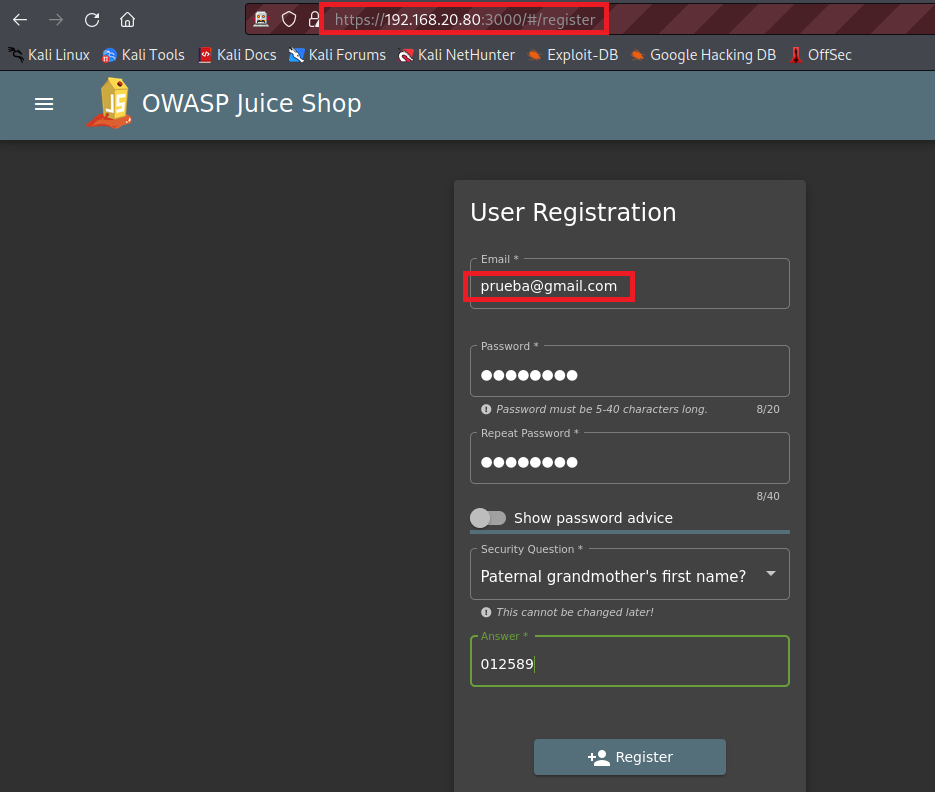

Pulsa el botón para crear el usuario.

Intenta entrar en la sección ***Administration***, escribiendo la siguiente URL en la barra de direcciones.
(Nota: Esta sección se descubrió en el ***Ejercicio 2*** del laboratorio ***lab-25-C***)
```
http://192.168.20.80:3000/#/administration
```


A continuación, accede a ZAP y localiza en el historial, la request que registró al usuario. Esta request es de tipo ***POST***. (Filtrar por POST)

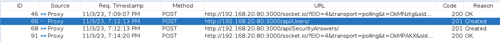

En la Request puedes observar los campos que se envían al servidor para crear al nuevo usuario.

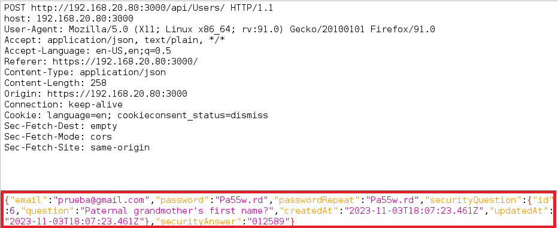

Y la response indica que el ***role*** del usuario es ***customer***.

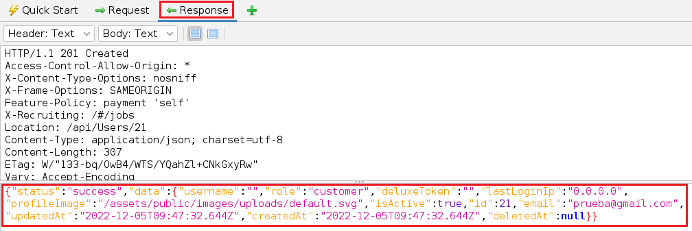

Hacemos clic derecho en la request anterior y elegimos ***Open/Resend with Request Editor*** para editarla.

Modifica los parámetros hasta que tengan la siguiente forma.

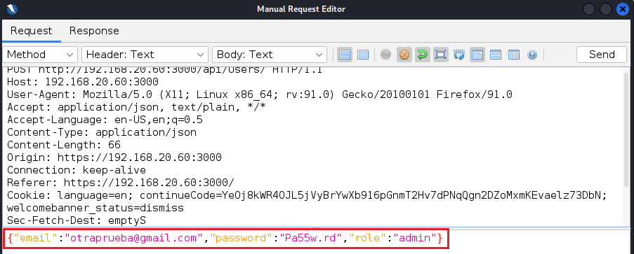

Hacemos clic en el botón ***Send***.

En la respuesta podrás ver que la API ha aceptado la creación del usuario de esta forma tan simple.

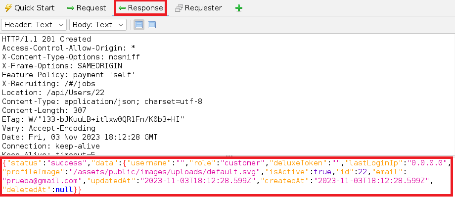

Observa como la response es aceptada ***success***. Mira también los valores para los campos ***email*** (otraprueba@gmail.com) y ***role*** (admin). El password es el que pusiste.

Cierra la sesión con el usuario actual e inicia sesión con el nuevo usuario. A continuación escribe en la barra de direcciones la siguiente URL.
```
http://192.168.20.80:3000/#/administration
```

Podrás comprobar que puedes acceder a la sección de administración de la aplicación.

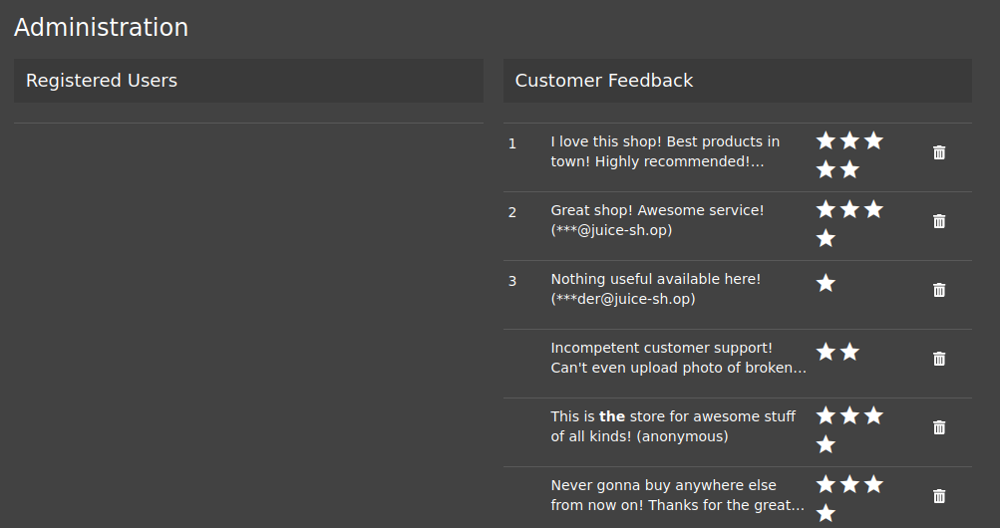


## Ejercicio 2: Hacer un pedido que te hará rico.

***OBJETIVO***: Conseguir que el total a pagar de un pedido sea una cantidad negativa.

***PISTAS***: 

* Haz un pedido. Modifica la cantidad del elemento que has pedido y estudia la request correspondiente.
* Reenvía la request cambiando algún parámetro.

***RESOLUCIÓN***. Los pasos para resolver el reto son.

Como siempre iniciamos ***ZAP***.

Realiza con ZAP una exploración manual sobre la siguiente URL.
```
http://192.168.20.80:3000
```

Inicia sesión con tu usuario de la aplicación y haz un pedido de una unidad de zumo de limón. Podrás comprobar que es posible cambiar la cantidad, pero que esta no puede ser negativa. 

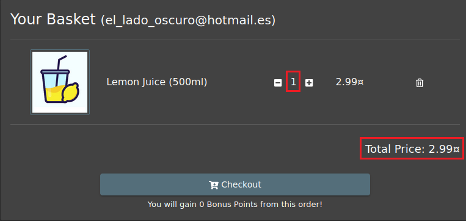

Cambia la cantidad de producto a ***5 unidades***.

Localiza la request que actualiza la cantidad de producto a ***5 unidades***. 

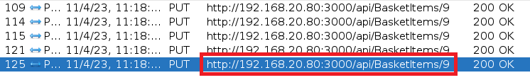

Haz clic en ella con botón derecho y ejecuta ***Open/Resend with Request Editor***. Edita el parámetro ***quantity*** y pon una cantidad negativa, por ejemplo ***-100***.

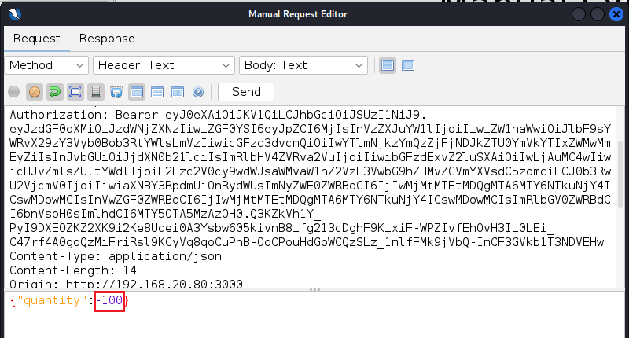

Reenvía la Request por medio del botón ***Send***.

A continuación, en la aplicación realiza el proceso de ***Checkout*** y comprobarás que tendrás más dinero que antes.

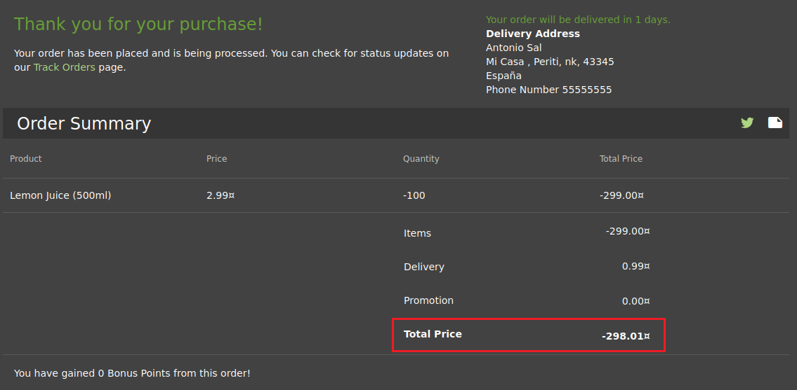


## Ejercicio 3: Registrar un usuario con privilegios de administrador.

***OBJETIVO***: Conseguir registrar un usuario como administrador enviando una request al servidor.

***PISTAS***: 
* Registra un usuario en la aplicación y captura la request que se envía al servidor.
* Compárala con una request de un administrador real (En un reto anterior aprendiste a convertirte en administrador) y busca en qué se diferencia un usuario administrador de un cliente normal.
* Reenvía la request original para registrar otro usuario con permisos de administrador.
* Usa ZAP o Burp.

***RESOLUCIÓN***. Los pasos para resolver el reto son.

Inicia Burp y configura el navegador para que lo use como proxy. Desactiva la interceptación de Burp.

Carga la página para registrar un nuevo usuario.
```
http://192.168.20.80:3000/login#/register
```

Rellena el formulario con la siguiente información.

Email.
```
prueba@hotmail.com
```

Password.
```
Pa55w.rd
```

Repeat Password.
```
Pa55w.rd
```

Como pregunta de seguridad, elige la que te apetezca. Rellena también la respuesta a dicha pregunta.

NO HAGAS clic aún en el botón ***Register***

En Burp, activa la interceptación.

Regresa al navegador y haz clic en ***Register***. Vuelve a Burp y haz clic en el botón ***Forward*** hasta alcanzar la request que nos interesa. Debe ser parecida a esta.

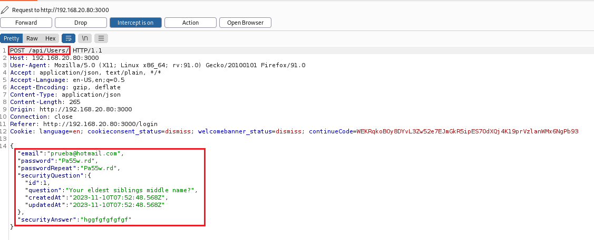

En la request puedes ver los campos que se envian al servidor. Sería interesante conocer cuáles son los enviados cuando el usuario es un administrador. Para facilitar la elaboración de esta práctica te aportamos esa información. No obstante, si quieres obtenerla por tí mismo, vuelve a realizar el laboratorio donde nos logamos como administrador. El laboratorio es ***lab-25-D Ejercicio 4. Iniciar sesión con el usuario administrador***.

En la siguiente imagen puedes ver dos request enviadas al servidor. Una para cuando el usuario es administrador y la otra cuando es un cliente.

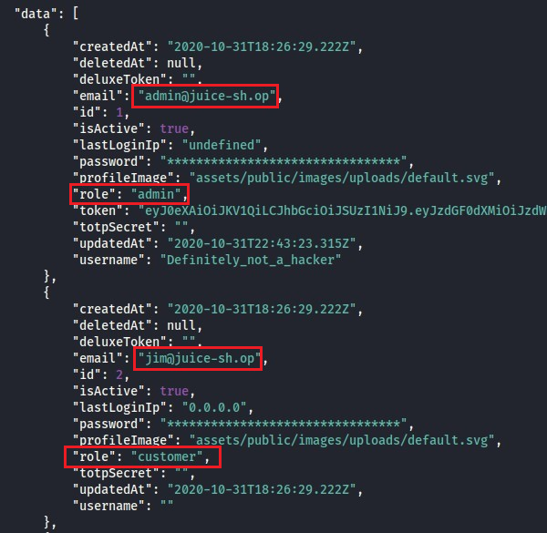

Si te das cuenta, la única diferencia importante está en el campo ***role***, que tiene el valor ***admin*** o ***customer***.

En Burp, vamos a modificar la request que tenemos capturada, agregando ***role=admin***, tal y como puedes ver en la siguiente imagen.

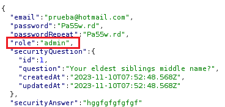

Haz clic en el botón ***Forward*** para enviar la Request al servidor y desactiva la interceptación.

Inicia sesión con el usuario que has creado.

Email.
```
prueba@hotmail.com
```

Password.
```
Pa55w.rd
```

Accede a la sección de administración.
```
http://192.168.20.80:3000/#/administration
```

Podrás comprobar que eres administrador de la aplicación.


## Ejercicio 4: Usar un cupón expirado

***OBJETIVO***: Conseguir un descuento que ya ha expirado.

***PISTAS***: 
* Realiza un pedido e intenta jugar con la aplicación escribiendo el código del cupón.
* Usa las herramientas del desarrollador y localiza en el código los descuentos.
* Cambia la hora del sistema para que coincida con la del cupón.

***RESOLUCIÓN***. Los pasos para resolver el reto son.

Logate en la aplicación y realiza un pedido. Cuando llegues a la parte del pago, intenta escribir el código de un cupón para que te apliquen un descuento.

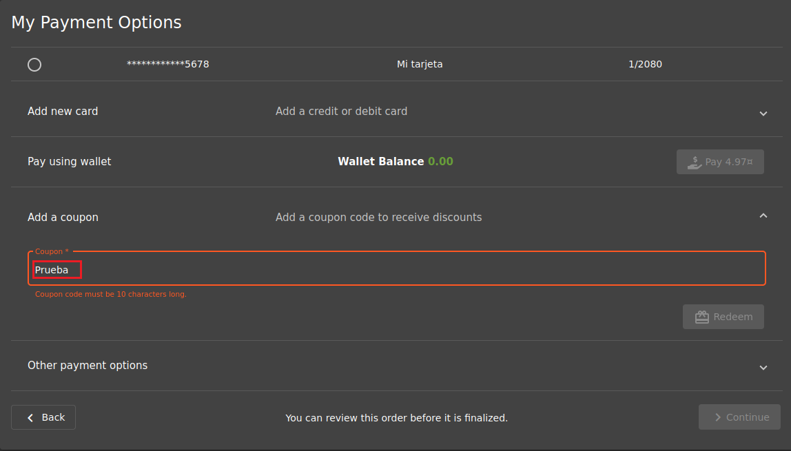

Como muchas aplicaciones modernas, una parte importante de la lógica se ejecuta en el navegador del usuario. Estudiamos el Javascript con la intención de localizar el código que gestiona la aplicación del cupón.

Habilita las herramientas del desarrollador y abre el archivo ***main.js***.

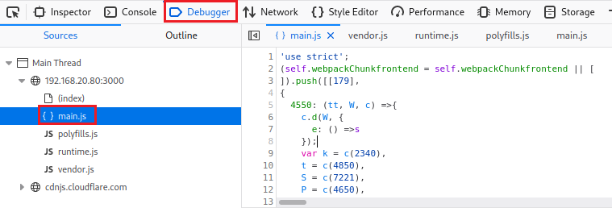

Para ahorrar tiempo en el desarrollo de la práctica, usa el buscador y escribe lo siguiente.
```
WMNSDY
```

Si eres cliente habitual de Juice Shop sabrás que todos los años emite un cupón que debe ser usado el Día de la Mujer, que es el 8 de Marzo. 

En el código puedes ver las distintas campañas a lo largo de los años.

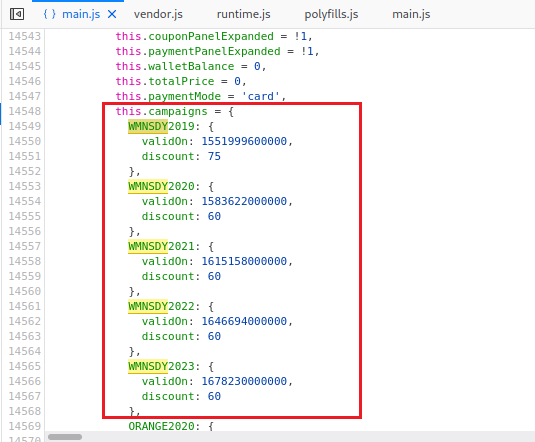

Cada cupón contiene un código, un campo que indica su validez y la cantidad de descuento que aplica.

Nos fijamos en uno de los cupones, por ejemplo el del Día de la Mujer del año 2023, cuyo código es ***WMNSDY2023*** y hace un descuento del 60%.

Volvemos a la aplicación y escribimos dicho código de descuento y hacemos clic en el botón ***Redeem***.

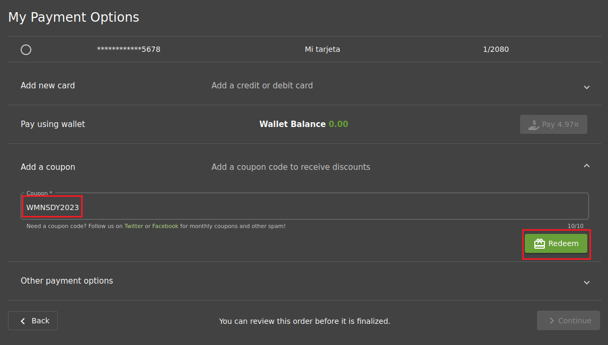

El cupón no es válido.

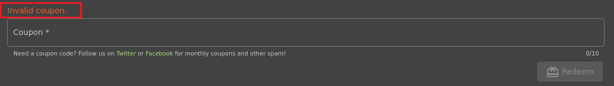

Si el cupón es para el Día de la Mujer y uno de los campos del cupón es sospechoso de contener la fecha (codificada de alguna manera), si esta comprobación se realiza en el cliente, podemos intentar cambiar la fecha del ordenador.

Nota: Ten en cuenta que Linux se sincronizará de nuevo con el RTC y la fecha/hora volverá a ser la actual, por lo que debes ser rápido a la hora de relizar el hackeo. 

Para ello, en una terminal de Kali, escribimos.  
```
sudo timedatectl set-time '2023-03-08'
```

Vuelve a realizar el pago usando el mismo código de cupón.
```
WMNSDY2023
```

Como puedes observar, se aplicará el descuento del cupón. Una mala idea aplicar los descuentos en el lado del cliente.

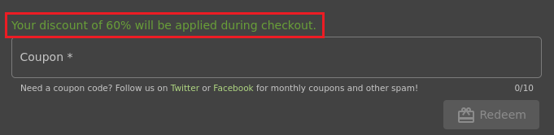


## Ejercicio 4: Dar una valoración devastadora de cero estrellas a la tienda.

***OBJETIVO***: Poner una reseña con cero estrellas (el mínimo es una) en la tienda.

***PISTAS***: 
* Visita en formulario ***Customer Feedback*** y escribe un comentario. Resuelve el Captcha.
* Activa Burp y modifica la request para enviar 0 estrellas en la reseña.


***RESOLUCIÓN***. Los pasos para resolver el reto son.

Activa Burp y configuralo como proxy en Firefox. Desabilita la interceptación.

Carga el formulario en la siguiente URL.
```
http://192.168.20.80:3000/#/contact
```

Rellénalo como ves en la imagen, selecciona alguna estrella para que se active el botón ***Submit***. No hagas clic en el botón.

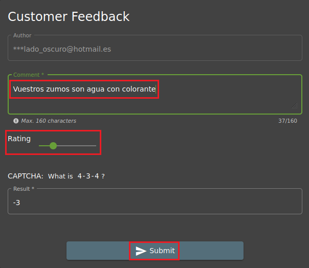

Ve a Burp y activa la interceptación. A continuación haz clic en el botón ***Forward*** hasta que veas una request como la siguiente.

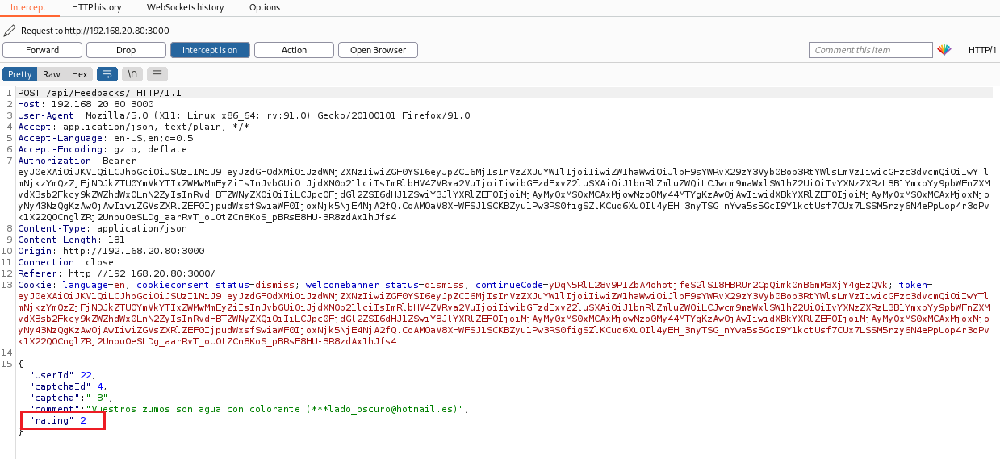

Modifica el rating de forma que aparezca un valor inverosímil, por ejemplo 0. El control de rating tiene un rango dinámico de 1 a 5 (estrellas) Envía la Request y desactiva la interceptación.

Esta versión de Juice Shop, en formato de contenedor, ya no es vulnerable a este ataque, pero el procedimiento indicado es útil para valorar la seguridad de las aplicaciones.

Accede al historial de request  (***HTTP History***). Localiza la request que envió la valoración. Haz clic con botón derecho y selecciona ***Send to Repeater***.

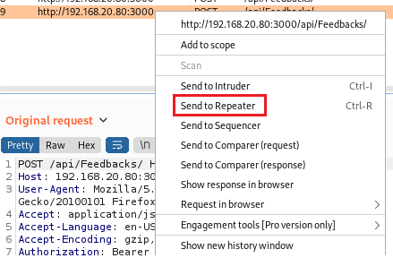

Observa la imagen. En primer lugar elige ***Repeater*** en el menú. Luego, en la parte inferior, asegurate que ***Rating=0***. Ahora, haz clic en el botón ***Send*** y observa la response.

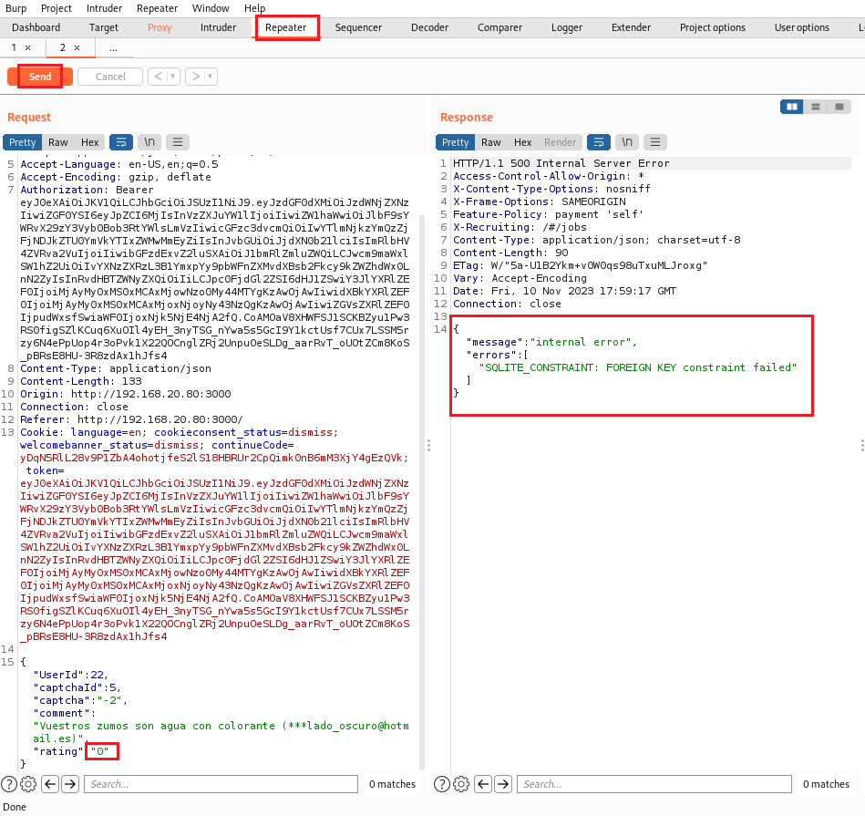

Como podrás comprobar, el servidor no acepta un rating de cero. Con ***Repeater*** puedes probar distintos valores (-4, null, 14), observarás como la Integridad Referencial de la base de datos no admite ningún valor extraño (En la versión anterior de Juice Shop, el rating se guardaba en una columna de tipo entero, lo que permitía almacenar valores fuera del rango [1-5])

***FIN DEL LABORATORIO***

[Vamos al siguiente lab](../25/lab-25-H.md)