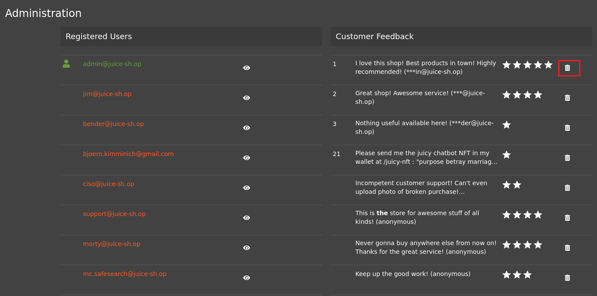

# Romper la autorización (***Broken Access Control***).

     

Requisitos:
1. Máquina ***Router-Ubu***.
2. Máquina ***Kali Linux***.
3. Máquina ***Ubu_srv_01***

Una aplicación incorrecta de los permisos de la aplicación puede conducir a que un usuario pueda realizar actividades que en principio no debería poder realizar. Estos privilegios pueden ser usados para eliminar archivos, ver información confidencial o instalar malware. Habitualmente ocurre cuando un sistema presenta vulnerabilidades que permiten saltarse el sistema de autorización.

## Ejercicio 1: Eliminar las reseñas de 5 estrellas de los clientes.

***OBJETIVO***: Eliminar las mejores reseñas.

***PISTAS***: 

* Necesitarás realizar un hack previo para conseguir logarte como administrador. Concretamente el laboratorio 25-D: Iniciar sesión con el usuario administrador.

***RESOLUCIÓN***. Los pasos para resolver el reto son.

Ve a la página de login.
```
http://192.168.20.80:3000/#/login
```

Lógate como administrador poniendo en el email lo siguiente.
```
' or 1=1--
```

y en el password el que quieras.

Ve a la sección de administración de la aplicación.
```
http://192.168.20.80:3000/#/administration
```

Elimina las reseñas de 5 estrellas haciendo clic en el icono de la papelera.



Aunque este reto se consigue suplantando la identidad del administrador, demuestra que es necesario implementar mecanismos más robustos para poder realizar ciertas acciones en la aplicación, como por ejemplo eliminar las reseñas. Aplicar una 2FA podría evitar este tipo de ataques o reducir el riesgo.


***FIN DEL LABORATORIO***


