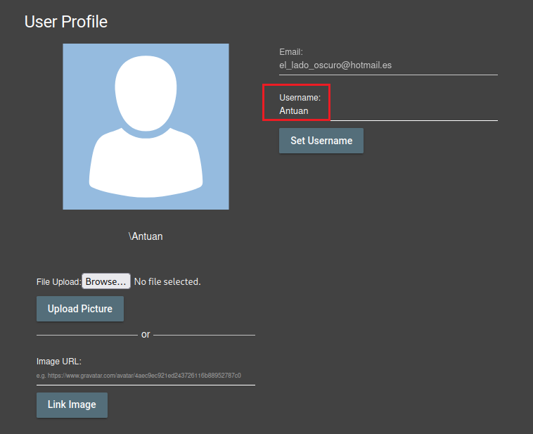

# Romper la autorización (***Broken Access Control***).

     

Requisitos:
1. Máquina ***Router-Ubu***.
2. Máquina ***Kali Linux***.
3. Máquina ***Ubu_srv_01***

Una aplicación incorrecta de los permisos de la aplicación puede conducir a que un usuario pueda realizar actividades que en principio no debería poder realizar. Estos privilegios pueden ser usados para eliminar archivos, ver información confidencial o instalar malware. Habitualmente ocurre cuando un sistema presenta vulnerabilidades que permiten saltarse el sistema de autorización.

## Ejercicio 1: Cambiar el nombre de un usuario realizando un CSRF desde otro origen.

***OBJETIVO***: Cambiar el nombre del usuario.

***PISTAS***: 

* Necesitarás que otro origen (sitio web) haga el submit del formulario del perfil de usuario de la aplicación. Generalmente este ataque se produce mediante el envío de un link malicioso a la víctima para conseguir que esta visite el otro origen mientras se encuentra logada en Juice Shop.

***RESOLUCIÓN***. Los pasos para resolver el reto son.

Si no estás logado en Juice Shop, hazlo. A continuación accede a la zona de perfil del usuario.
```
http://192.168.20.80:3000/profile
```

Asegúrate de poner un nombre de usuario, tal y como muesta la imagen.




***FIN DEL LABORATORIO***


