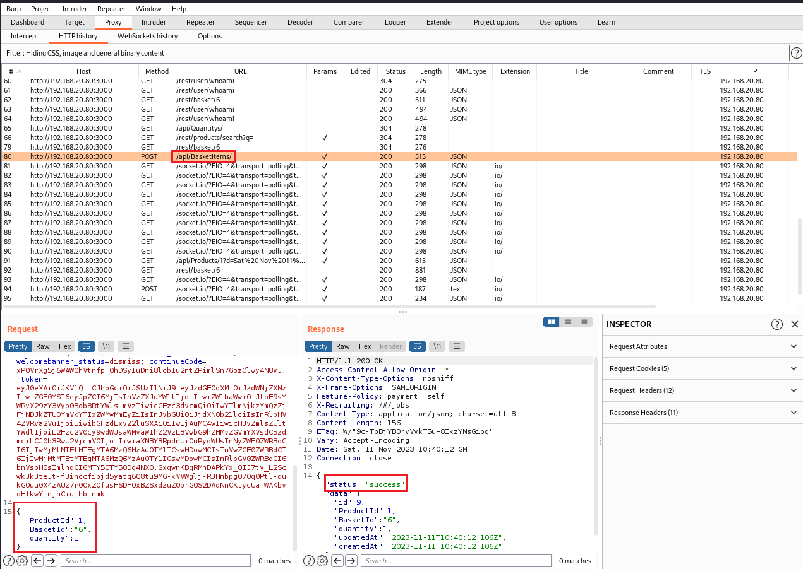

# Romper la autorización (***Broken Access Control***).

     

Requisitos:
1. Máquina ***Router-Ubu***.
2. Máquina ***Kali Linux***.
3. Máquina ***Ubu_srv_01***

Una aplicación incorrecta de los permisos de la aplicación puede conducir a que un usuario pueda realizar actividades que en principio no debería poder realizar. Estos privilegios pueden ser usados para eliminar archivos, ver información confidencial o instalar malware. Habitualmente ocurre cuando un sistema presenta vulnerabilidades que permiten saltarse el sistema de autorización.

## Ejercicio 1: Eliminar las reseñas de 5 estrellas de los clientes.

***OBJETIVO***: Eliminar las mejores reseñas.

***PISTAS***: 

* Necesitarás realizar un hack previo para conseguir logarte como administrador. Concretamente el laboratorio 25-D: Iniciar sesión con el usuario administrador.

***RESOLUCIÓN***. Los pasos para resolver el reto son.

Ve a la página de login.
```
http://192.168.20.80:3000/#/login
```

Lógate como administrador poniendo en el email lo siguiente.
```
' or 1=1--
```

y en el password el que quieras.

Ve a la sección de administración de la aplicación.
```
http://192.168.20.80:3000/#/administration
```

Elimina las reseñas de 5 estrellas haciendo clic en el icono de la papelera.


Aunque este reto se consigue suplantando la identidad del administrador, demuestra que es necesario implementar mecanismos más robustos para poder realizar ciertas acciones en la aplicación, como por ejemplo eliminar las reseñas. Aplicar una 2FA podría evitar este tipo de ataques o reducir el riesgo.


## Ejercicio 2: Poner una reseña a nombre de otro usuario.

***OBJETIVO***: Suplantar la identidad de otro usuario en una reseña.

***PISTAS***: 

* Usa Burp para determinar cómo se envía la información de reseña de un usuario anónimo.

***RESOLUCIÓN***. Los pasos para resolver el reto son.

Inicia Burp y desactiva la interceptación.

Si estás logado desconéctate.

Ahora vamos a poner una reseña anónima, puesto que no estamos logados a la aplicación. Para ello Selecciona la opción ***Customer feedback*** en el menú de la izquierda.


Observa cómo la reseña es anónima y se le ha dado la puntuación mínima (1 estrella). NO HAGAS clic en el botón ***Submit***.


Activa la interceptación de Burp y luego haz clic en el botón ***Submit***.

Como puedes observar en la imagen, la información que se envía al servidor es la lógica. Haz clic en ***Drop*** para no enviar la reseña.


Vuelve a Firefox, activa las herramientas del desarrollador y estudia el código relacionado con el formulario. Para facilitar la práctica, localiza el campo ***userID***.

Observarás que hay un campo con ese nombre, de tipo ***input*** que está oculto.


Elimina el atributo ***Hidden*** y verás cómo se renderiza el control en el formulario.


Tiene toda la pinta que, cuando el usuario está logado, se envía su identificador a través de este campo oculto. Escribe un valor, por ejemplo ***15*** y haz clic de nuevo en el botón ***Submit***. Burp capturará la request. Si tienes problemas, vuelve a cargar la página e inténtalo de nuevo.

Localiza la requests y envíala al ***Repeater***. Luego ve a la herramienta ***Repeater***.


Envía la request y observa la response. Efectivamente, como sospechamos se ha enviado el identificador de usuario. 


Solo queda mejorar el ataque e introducir el id de un usuario "importante" en la aplicación, por ejemplo, el administrador. En hackeos previos fuimos capaces de obtener los ids de todos los usuarios. El del administrador es el ***1***.

Modifica el id y cambia el ***15*** por el ***1***. Cambia también el comentario, para que no aparezca el texto ***anonymous***. En su lugar puedes poner, por ejemplo, el usuario del administrador


Envía de nuevo la request con Repeater y desactiva la interceptación.

Para leer las reseñas de los clientes, accede a la opción ***About us*** del menú izquierdo.


Podrás ves una magnífica reseña del administrador de Juice Shop.


## Ejercicio 3: Poner un producto adicional en la cesta de otro usuario.

***OBJETIVO***: Agregar un producto en la cesta de otro cliente.

***PISTAS***: 

* Usa Burp para inspeccionar el tráfico que ocurre cuando agregas un producto a tu propia cesta. Estudia los parámetros que se envían en la request.
* El hackeo se basa en la polución de parámetros de entrada, concretamente en repetir alguno de ellos.


***RESOLUCIÓN***. Los pasos para resolver el reto son.

Inicia Burp y desactiva la interceptación.

Lógate con tu usuario, fíjate en un producto, pero NO LO agregues a la cesta.

Activa la interceptación de Burp y haz clic en el botón ***Add to Basket*** en el producto.

En la imagen puedes ver el token de autorización que se envía al servidor y que permite agregar el producto a tu cesta. En la parte inferior, puedes ver que el ***id del producto*** es el ***1***, que el ***id de tu cesta*** es la ***6*** (esto podría cambiar para cada uno de nosotros) y que la ***cantidad*** es ***1***.


Desactiva la interceptación de Burp para que se procesen todas las resquest pendientes y se agregue el producto a tu cesta.

La debilidad presente en la aplicación se basa en que es posible actualizar diferentes entradas de la base de datos a partir del mismo objeto JSON. El programa solo verifica la autorización una vez, puesto que el programador ha supuesto que todas las entradas serán del mismo usuario (mismo id de la cesta).

Localiza en burp la request que añadió el producto a tu cesta. Es la que tiene ***/api/BasketItems*** en la URL.



Con botón derecho envíala al ***Repeater*** y accede a la herramienta ***Repeater*** en el menú.

Modifica el JSON que manda la request, tal y como muestra la imagen. En color rojo hemos marcado lo que debes añadir, mientras que en color amarillo se corresponde con el objeto JSON original.


El ***ProductId: 10*** es el producto que deseamos que aparezca en la cesta de la víctima. ***BasketId: 1*** es la cesta de la víctima, que se corresponde con la del usuario Bender (Esta información ya la obtuvimos de un hackeo previo)

Reenvía la request, dará un error porque efectivamente no es tu ***BasketId***, pero la consulta de actualización en la base de datos se habrá realizado.

Vamos a entrar con el usuario Bender y para ello procedemos a hackear su contraseña rápidamente a través del procedimiento de recuperación de la contraseña. Esto es así porque si el contenedor de Juice Shop se ha reiniciado, habremos perdido todos los cambios.

En la página de login, escribe lo siguiente.

En el email.
```
bender@juice-sh.op
```

y haz clic en el enlace  ***Forgot your Password?***. 

En la respuesta a la pregunta de seguridad, escribe.
```
Stop'n'Drop
```

y pon una nueva contraseña.

Ahora inicia sesión como Bender y observa el carrito.


En definitiva, la aplicación te autoriza a almacenar pedidos en la base de datos, pero no comprueba si el BasketId es el apropiado. De esta forma nos hemos saltado la autorización.

***FIN DEL LABORATORIO***


[Vamos al siguiente lab](../25/lab-25-I.md)