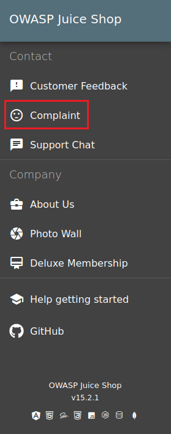
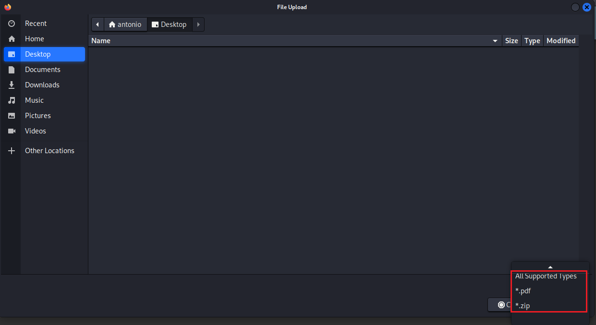
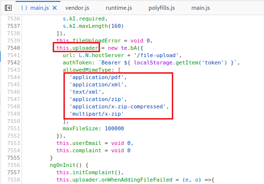
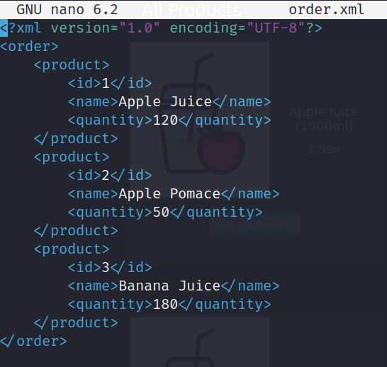
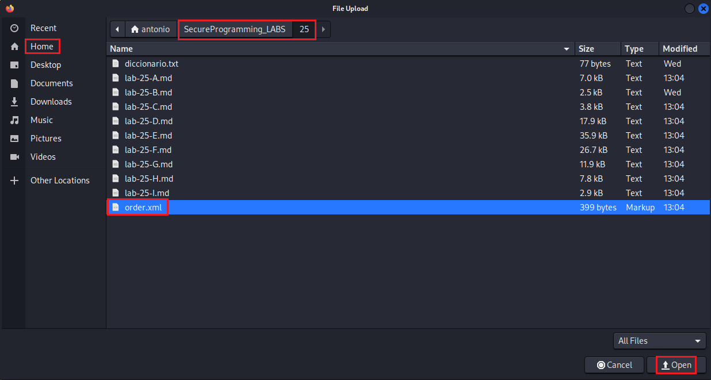
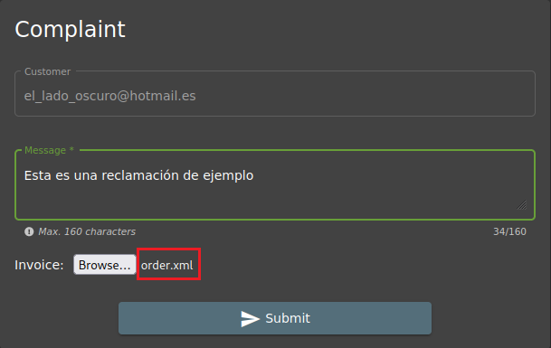

#  Errores de configuración de seguridad (***Security Misconfiguration***).

     

Requisitos:
1. Máquina ***Router-Ubu***.
2. Máquina ***Kali Linux***.
3. Máquina ***Ubu_srv_01***

La ***configuración de seguridad incorrecta*** es un riesgo común que se produce cuando los elementos de software, servidores, o aplicaciones no están configurados de manera adecuada, dejando brechas de seguridad potenciales. 

Este tipo de vulnerabilidad puede surgir en diversas capas de una aplicación, desde la configuración del servidor web hasta los permisos de archivos. Errores en la gestión de accesos, configuraciones predeterminadas no seguras o permisos excesivos pueden dejar la puerta abierta a atacantes malintencionados.

Los impactos de la Security Misconfiguration pueden variar desde la divulgación no autorizada de información hasta la toma completa de un sistema. Es crucial realizar auditorías regulares, implementar las mejores prácticas de seguridad y mantener actualizado elsoftware para mitigar estos riesgos. L

## Ejercicio 1: Usar una interfaz B2B antigua que no ha sido retirada convenientemente..

***OBJETIVO***: Interactuar con una interfaz de la aplicación que no debería estar funcionando.

***PISTAS***: 

* Juice Shop es una aplicación principalmente para los usuarios (B2C), pero también ofrece un mencanismo para que otras empresas realicen pedidos de grandes cantidades de productos (B2B).
* La vieja interfaz B2B ha sido reemplazada por una nueva, pero no todas sus partes se eliminaron del código fuente. Concretamente los pedidos se realizaban subiendo archivos XML.
* El objetivo del reto es demostrar que aún hay reminiscencias de la antigua interfaz.

***RESOLUCIÓN***. Los pasos para resolver el reto son.

Ve a la página de login e inicia sesión con tu usuario.
```
http://192.168.20.80:3000/#/login
```

En el menú lateral izquierdo, en la sección ***Contact***, entra en ***Compliant***, pera poner una reclamación.



En el formulario de reclamación observarás que hay un botón ***Browse*** para subir archivos. Haz clic en él.

Observa que los únicos tipos de archivos que se permiten son ***pdf*** y ***zip***.



Habilita las herramientas del desarrollador y abre el archivo de código fuente ***main.js***. Localiza con el buscador y localiza las referencias a ***zip***, hasta que llegues a la siguiente parte del código del ***uploades***. Comprueba los tipos MIME admitidos. Observarás que también se permite el tipo MIME ***xml***, que ya no debería ser admitido porque pertenece a la antigua interfaz y no se ha retirado del código de la aplicación.



En una terminal, ejecuta los siguientes comandos.
```
cd ~/SecureProgramming_LABS/25
```

```
nano order.xml
```

Podrás ver un archivo XML que se utilizaba para realizar antiguamente los pedidos masivos.



Si bien la aplicación ya retiró la API para recibir este tipo de archivos, has comprobado que en ciertas partes del código no se ha retirado la capacidad de subir estos archivos (y debería haberse hecho).

Vuelve a el formulario de reclamaciones e intenta subir el archivo ***order.xml***.



Como puedes ver, la aplicación permite subir el archivo.



Haz clic en el botón ***Submit***.

Realmente no se produce hackeo alguno. Simplemente se está verificando una configuración de seguridad problemática, porque la aplicación no debería permitir subir archivos XML si ya no los usa. 

La posibilidad de subir archivos al servidor podría hacer posible otros tipos de hackeos que usaran el archivo subido, por esto se considera un error en la configuración de seguridad de la aplicación.


***FIN DEL LABORATORIO***


